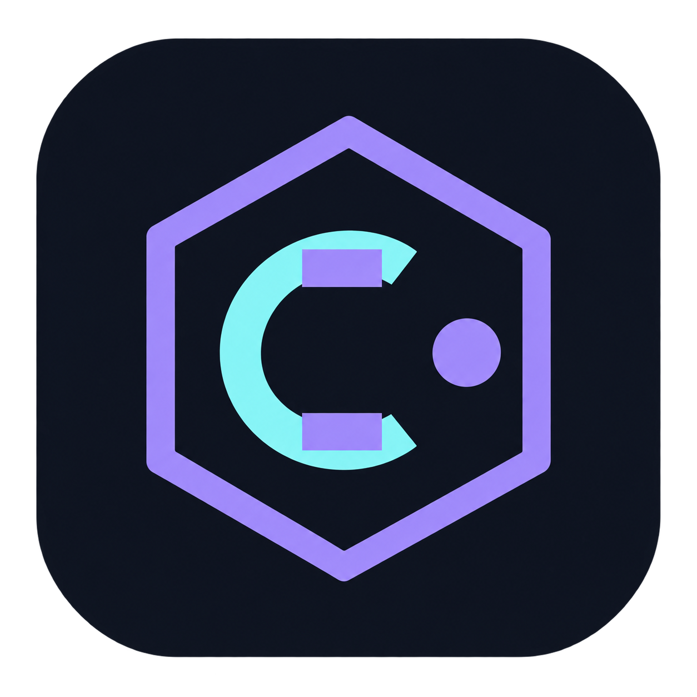

<div align="center">



<h1>Coco IDE</h1>

<p>
  <b>Удобная среда разработки для CDM-8</b>
</p>

<p>
  Редактирование, запуск и отладка программ в одном простом интерфейсе.
</p>

<p>
  <a href="https://github.com/Rayvent/Coco-IDE/releases/latest"><b>🪟 Windows</b></a>
  &nbsp;&nbsp;•&nbsp;&nbsp;
  <a href="https://github.com/Rayvent/Coco-IDE/releases/latest"><b> macOS</b></a>
  &nbsp;&nbsp;•&nbsp;&nbsp;
  <a href="https://github.com/Rayvent/Coco-IDE/releases">Все версии</a>
</p>

</div>

---

## О проекте

**Coco IDE** — интегрированная среда разработки для **CDM-8**, созданная для простого и удобного процесса разработки.

Она объединяет основные инструменты для написания, запуска и отладки программ в одном понятном интерфейсе.

## Возможности

- ✏️ Редактирование исходного кода
- ▶️ Запуск программ
- 🐞 Инструменты отладки
- 💻 Простой и понятный интерфейс
- 🪟 Windows
- 🍎 macOS

## Скачать

Актуальные версии **Coco IDE** находятся в разделе
[**Releases →**](https://github.com/Rayvent/Coco-IDE/releases/latest)

### 🪟 Windows

Скачайте версию для Windows из раздела **Assets** последнего релиза и запустите установочный файл.

[**Скачать для Windows →**](https://github.com/Rayvent/Coco-IDE/releases/latest)

### 🍎 macOS

Для macOS доступны версии для **Apple Silicon** и **Intel**.

Скачайте подходящий архив из раздела **Assets**, распакуйте его и перенесите Coco IDE в папку **Программы**.

[**Скачать для macOS →**](https://github.com/Rayvent/Coco-IDE/releases/latest)

## Установка

### Windows

1. Скачайте последнюю версию Coco IDE.
2. Запустите установочный файл.
3. Следуйте инструкциям установщика.

### macOS

1. Скачайте версию для вашего процессора.
2. Распакуйте архив.
3. Перенесите Coco IDE в папку **Программы** (`Applications`).

Если macOS блокирует запуск приложения, скачанного из официального репозитория Coco IDE, откройте **Терминал**.

Для Apple Silicon:

```bash
xattr -dr com.apple.quarantine "/Applications/CocoIDE Apple Silicon.app"
